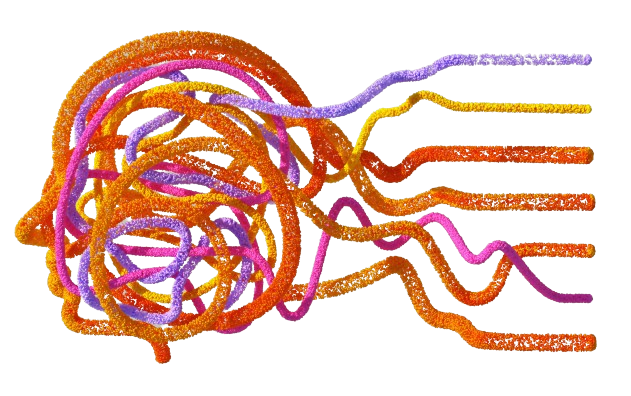

<a name="readme-top"></a>

<!-- PROJECT SHIELDS -->
<!--
*** I'm using markdown "reference style" links for readability.
*** Reference links are enclosed in brackets [ ] instead of parentheses ( ).
*** See the bottom of this document for the declaration of the reference variables
*** for contributors-url, forks-url, etc. This is an optional, concise syntax you may use.
*** https://www.markdownguide.org/basic-syntax/#reference-style-links
-->
[![Contributors][contributors-shield]][contributors-url]
[![Forks][forks-shield]][forks-url]
[![Stargazers][stars-shield]][stars-url]
[![Issues][issues-shield]][issues-url]
[![MIT License][license-shield]][license-url]
[![LinkedIn][linkedin-shield]][linkedin-url]


<!-- PROJECT LOGO -->
<br />
<div align="center">
  <a href="https://github.com/Neumann-Labs/NimbleNet">
    
  </a>

<h3 align="center">NimbleNet</h3>

  <p align="center">
    NimbleNet is a lightweight, optimized Neural Network Framework written from scratch in C++
    <br />
    <a href="https://github.com/Neumann-Labs/NimbleNet"><strong>Explore the docs »</strong></a>
    <br />
    <br />
    <a href="https://github.com/Neumann-Labs/NimbleNet">View Demo</a>
    ·
    <a href="https://github.com/Neumann-Labs/NimbleNet/issues/new?labels=bug&template=bug-report---.md">Report Bug</a>
    ·
    <a href="https://github.com/Neumann-Labs/NimbleNet/issues/new?labels=enhancement&template=feature-request---.md">Request Feature</a>
  </p>
</div>


<!-- TABLE OF CONTENTS -->
<details>
  <summary>Table of Contents</summary>
  <ol>
    <li>
      <a href="#about-the-project">About The Project</a>
      <ul>
        <li><a href="#built-with">Built With</a></li>
      </ul>
    </li>
    <li>
      <a href="#getting-started">Getting Started</a>
      <ul>
        <li><a href="#prerequisites">Prerequisites</a></li>
        <li><a href="#installation">Installation</a></li>
      </ul>
    </li>
    <li><a href="#usage">Usage</a></li>
    <li><a href="#roadmap">Roadmap</a></li>
    <li><a href="#contributing">Contributing</a></li>
    <li><a href="#license">License</a></li>
    <li><a href="#contact">Contact</a></li>
    <li><a href="#acknowledgments">Acknowledgments</a></li>
  </ol>
</details>


<!-- ABOUT THE PROJECT -->
## About The Project

NimbleNet is a lightweight, optimized Neural Network Framework written from scratch in C++.

<p align="right">(<a href="#readme-top">back to top</a>)</p>


### Built With

* [![C++][Cpp]][Cpp-url]
* [![CMake][CMake]][Cmake-url]
* [![Cuda][Cuda]][Cuda-url]
* [![OpenCL][OpenCL]][OpenCL-url]

<p align="right">(<a href="#readme-top">back to top</a>)</p>


<!-- GETTING STARTED -->
## Getting Started

To get a local copy up and running follow these simple example steps.

### Prerequisites

This is an example of how to list things you need to use the software and how to install them.
* C++
  - If you run a modern operating system, odds are C++ is already
  installed on your machine. You can check for it by running the following
  command in a terminal: 
   ```sh
   g++ --version
   ```
  - If you do not get a version output, follow the [instructions for installing C++](https://www.learncpp.com/cpp-tutorial/installing-an-integrated-development-environment-ide/)

* Cmake
  - [CMake install instructions](https://cliutils.gitlab.io/modern-cmake/chapters/intro/installing.html)

* Cuda (Optional for Nvidia GPU acceleration)
  - [Windows Cuda Install Instructions](https://docs.nvidia.com/cuda/cuda-installation-guide-microsoft-windows/index.html)
  - [Linux Install Instructions](https://docs.nvidia.com/cuda/cuda-installation-guide-linux/)

* OpenCL (Optional for Non-Nvidia GPU acceleration)
  - [Windows OpenCL Install Instructions](https://github.com/KhronosGroup/OpenCL-Guide/blob/main/chapters/getting_started_windows.md)
  - [Linux OpenCL Install Instructions](https://github.com/KhronosGroup/OpenCL-Guide/blob/main/chapters/getting_started_linux.md)
  
### Installation

1. Clone the repo
   ```sh
   git clone https://github.com/Neumann-Labs/NimbleNet.git
   ```
   
2. Build with CMake
   ```sh
   cmake make
   ```

<p align="right">(<a href="#readme-top">back to top</a>)</p>


<!-- USAGE EXAMPLES -->
## Usage

Coming Soon

 _For more examples, please refer to the [Documentation](https://neumann-labs.com/nimblenet)_ 

<p align="right">(<a href="#readme-top">back to top</a>)</p>


<!-- ROADMAP -->
## Roadmap


1. Core Components:
   - [ ] Tensor Library:
     - [ ] Implement multi-dimensional array class
     - [ ] Implement element-wise operations
     - [ ] Implement broadcasting
     - [ ] Implement memory management
   - [ ] Autograd Engine:
     - [x] Implement reverse-mode autodiff
     - [ ] Implement dynamic computation graph
     - [ ] Implement gradient accumulation
     - [x] Implement gradient zeroing
   - [ ] Operator Library:
     - [x] Implement basic math operators (+, -, *, /, etc.)
     - [ ] Implement matrix multiplication
     - [ ] Implement convolution operator
     - [ ] Implement pooling operators (max, average)
     - [ ] Implement activation functions (ReLU, sigmoid, tanh)
     - [ ] Implement loss functions (MSE, cross-entropy)

2. Neural Network Layers:
   - [x] Implement fully connected layer
   - [ ] Implement convolutional layer
   - [ ] Implement recurrent layers (RNN, LSTM, GRU)
   - [ ] Implement attention mechanism
   - [ ] Implement normalization layers (Batch Norm, Layer Norm)
   - [ ] Implement dropout regularization

3. Optimization and Training:
   - [ ] Implement optimization algorithms:
     - [ ] Stochastic Gradient Descent (SGD)
     - [ ] Adam optimizer
     - [ ] RMSprop optimizer
   - [ ] Implement learning rate scheduling
   - [ ] Implement momentum and Nesterov momentum
   - [ ] Implement weight decay regularization
   - [ ] Implement gradient clipping
   - [ ] Implement data loading and batching
   - [ ] Implement model checkpointing and saving

4. Hardware Acceleration:
   - [ ] Implement CUDA support for GPU acceleration
   - [ ] Implement OpenCL support for GPU acceleration
   - [ ] Implement optimized kernels for basic operations
   - [ ] Implement parallel reduction for efficient gradient accumulation
   - [ ] Implement memory pooling for efficient memory management

5. Serialization and Deployment:
   - [ ] Implement model serialization and deserialization
   - [ ] Implement support for saving and loading trained models
   - [ ] Implement model deployment for inference in C++ applications
   - [ ] Implement Python bindings for model deployment

6. Compiler Optimizations:
   - [ ] Implement graph-level optimizations:
     - [ ] Operator fusion
     - [ ] Constant folding
     - [ ] Dead code elimination
   - [ ] Implement automatic code generation for optimized kernels
   - [ ] Implement cost modeling for performance optimization
   - [ ] Implement support for different hardware backends

7. Interoperability and Ecosystem:
   - [ ] Implement Python bindings for easy integration with Python workflows
   - [ ] Implement compatibility with popular data formats (NumPy, Pandas)
   - [ ] Implement integration with popular data loading libraries (OpenCV, LibSVM)
   - [ ] Implement support for distributed training using MPI or other frameworks

8. Testing and Documentation:
   - [ ] Implement unit tests for core components
   - [ ] Implement integration tests for end-to-end functionality
   - [ ] Implement performance benchmarks and profiling
   - [ ] Write comprehensive API documentation
   - [ ] Provide tutorials and examples for common use cases
   - [ ] Set up continuous integration and continuous deployment (CI/CD) pipeline

See the [open issues](https://github.com/Neumann-Labs/NimbleNet/issues) for a full list of proposed features (and known issues).

<p align="right">(<a href="#readme-top">back to top</a>)</p>

<!-- CONTRIBUTING -->
## Contributing

Contributions are what make the open source community such an amazing place to learn, inspire, and create. Any contributions you make are **greatly appreciated**.

If you have a suggestion that would make this better, please fork the repo and create a pull request. You can also simply open an issue with the tag "enhancement".
Don't forget to give the project a star! Thanks again!

1. Fork the Project
2. Create your Feature Branch (`git checkout -b feature/AmazingFeature`)
3. Commit your Changes (`git commit -m 'Add some AmazingFeature'`)
4. Push to the Branch (`git push origin feature/AmazingFeature`)
5. Open a Pull Request

<p align="right">(<a href="#readme-top">back to top</a>)</p>


<!-- LICENSE -->
## License 

Distributed under the MIT License. See `LICENSE.txt` for more information.

<p align="right">(<a href="#readme-top">back to top</a>)</p>


<!-- CONTACT -->
## Contact

Nicholi Caron - [@nicholicaron](https://twitter.com/nicholicaron) - nicholi@neumann-labs.com

Website: [https://www.neumann-labs.com/](https://github.com/Neumann-Labs/NimbleNet)

<p align="right">(<a href="#readme-top">back to top</a>)</p>


<!-- ACKNOWLEDGMENTS -->
## Acknowledgments

* [Andrej Karpathy](https://www.youtube.com/@AndrejKarpathy)
* ["Understanding Deep Learning" by Simon J. D. Prince](https://udlbook.github.io/udlbook/)

<p align="right">(<a href="#readme-top">back to top</a>)</p>


<!-- MARKDOWN LINKS & IMAGES -->
<!-- https://www.markdownguide.org/basic-syntax/#reference-style-links -->
[contributors-shield]: https://img.shields.io/github/contributors/Neumann-Labs/NimbleNet.svg?style=for-the-badge
[contributors-url]: https://github.com/Neumann-Labs/NimbleNet/graphs/contributors
[forks-shield]: https://img.shields.io/github/forks/Neumann-Labs/NimbleNet.svg?style=for-the-badge
[forks-url]: https://github.com/Neumann-Labs/NimbleNet/network/members
[stars-shield]: https://img.shields.io/github/stars/Neumann-Labs/NimbleNet.svg?style=for-the-badge
[stars-url]: https://github.com/Neumann-Labs/NimbleNet/stargazers
[issues-shield]: https://img.shields.io/github/issues/Neumann-Labs/NimbleNet.svg?style=for-the-badge
[issues-url]: https://github.com/Neumann-Labs/NimbleNet/issues
[license-shield]: https://img.shields.io/github/license/othneildrew/Best-README-Template.svg?style=for-the-badge 
[licnse-url]: https://github.com/othneildrew/Best-README-Template/blob/master/LICENSE.txt
[linkedin-shield]: https://img.shields.io/badge/-LinkedIn-black.svg?style=for-the-badge&logo=linkedin&colorB=555
[linkedin-url]: https://linkedin.com/in/nicholicaron
[product-screenshot]: images/screenshot.png
[Cpp]:https://img.shields.io/badge/-C++-blue?logo=cplusplus
[Cpp-url]: https://cplusplus.com/
[Cuda]: https://img.shields.io/badge/cuda-12.2-green
[Cuda-url]: https://developer.nvidia.com/cuda-toolkit
[OpenCL]: https://img.shields.io/badge/OpenCL-pink
[OpenCL-url]: https://www.khronos.org/opencl/
[CMake]: https://img.shields.io/badge/cmake-purple
[CMake-url]: https://cmake.org/
